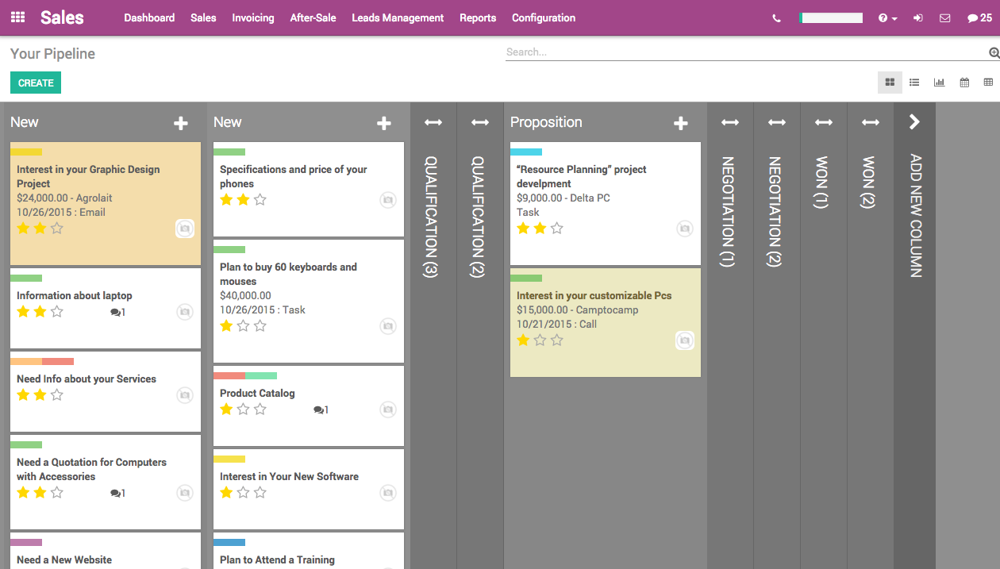
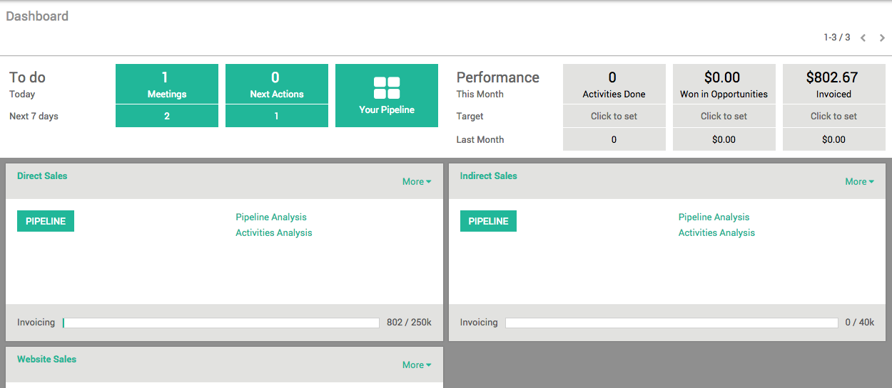
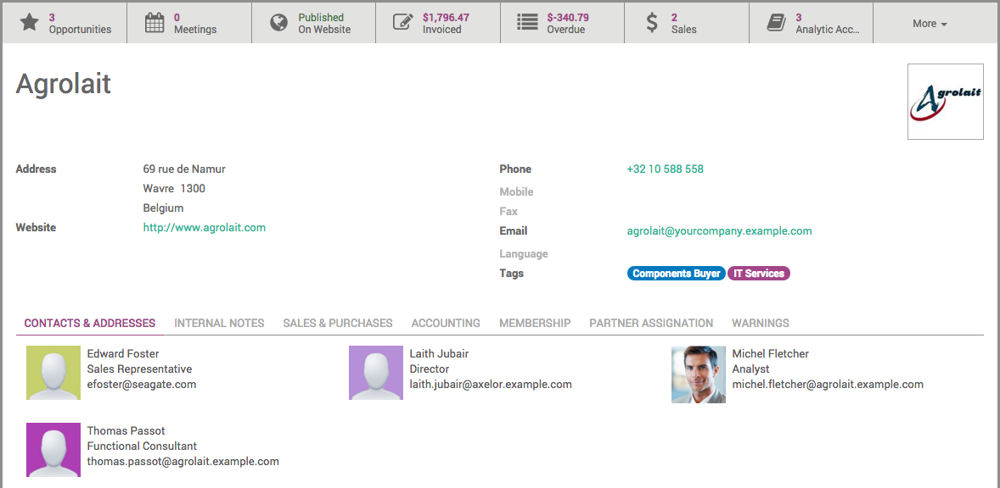

===========================================
Conociendo la interfaz del módulo de Ventas
===========================================

Al entrar al módulo, se verá un tablero en la página principal, el cual 
en la parte superior muestra los *diferentes menús* con los que cuenta; 
después vienen las *cosas por hacer*, así como las *reuniones* las cuales 
se muestran de diferentes maneras, por día o por semana; y de lado derecho 
se reflejan respecto a lo programado, reflejando lo ganado o estimado a 
ganar. Y en la parte inferior se encuentran clasificados los *equipos de 
trabajo* y su rendimiento.

En la parte superior izquierda, vienen las cosas por hacer, pendientes, citas 
y reuniones. Se clasifican según su importancia. Primero las que son del día 
y abajo las que son de la semana. Así como las actividades a realizar, acomodadas 
de la misma manera. A un lado se encuentra el flujo de ventas, el cual se 
desglosa en una vista Kanban.

En el Banner de "*Cosas por hacer*", se pueden ver los pendientes a realizar o 
acciones que se hayan pactado con el cliente.

- **Citas**: se muestran en un calendario, el cual puedes modificar desde aquí o desde cada cliente. Se separan en dos vistas, por el día en curso y por la semana. Este calendario se puede sincronizar con Google y con el de otros usuarios. 

- **Acción Siguiente**: muestra las actividades que hay que hacer anotadas en el módulo y su acomodo de estas es por fecha, la actividad inmediata será la primera en la lista. 

- **Flujo de Ventas**: aquí se mostrarán los estados de cada venta y su historial en una vista de Kanban, se acomodarán los procesos según las necesidades de la empresa.

También de lado derecho se muestran los *Avances* y las *Metas* que se quieren lograr con las ventas. 
El desempeño se desglosa por mes, objetivo y el último mes. Se desglosan en tres columnas: 
actividades, oportunidad de ingreso, facturado.

- **Actividad**: aquí se comparan las actividades que se han generado con el último mes y con el objetivo puesto por la empresa o personal. 

- **Oportunidad de ingreso**: estas cantidades son en pesos, de así requerirse para incentivar a los usuarios a poder superar la meta o lo vendido el mes anterior. 

- **Facturado**: se hace una comparación de lo que sí se ha concretado vender y que ya está facturado.

En la parte inferior se ve cada *Equipo de trabajo*, los cuales pueden mostrar el flujo de trabajo, 
y así reduciendo todas las ventas exclusivamente a ese grupo. Así mismo cada grupo puede ver los 
análisis de sus ventas, donde aquí se pueden utilizar los filtros como mejor se ajusten a los 
procesos de la empresa y a lo que se necesita en el momento. De igual manera estos análisis se 
pueden realizar de dos maneras diferentes, análisis del flujo de ventas y análisis de las actividades 
que se han realizado. En cada grupo se ven reflejadas las facturas realizadas y el porcentaje que falta 
para llegar a ellas.

Los menús del módulo de Ventas
==============================

Los diferentes menús con los que cuenta el módulo son los siguientes:

- **Tablero**: muestra la interfaz inicial del módulo. Un vistazo general de todo el módulo y su contenido.

- **Ventas**: en este menú se ve el flujo que van teniendo las ventasde manera más detallada; los clientes, las siguientes actividades a realizar, las citas, órdenes de venta y productos. 

- **Facturación**: las facturas de las ventas y las órdenes sobre ventas.

- **Después de la venta**: muesta las devoluciones y/o reclamaciones.

- **Clientes/Prospectos**: aquí se podrá tener un resgitro detallado de cada cliente o prospecto, quién es su responsable, historial del mismo y todos los detalles posibles del mismo.

- **Reporte**: en este menú se puede hacer un reporte detallado de lo que se necesita, según la necesidad del momento.

- **Configuración**: la parte técnica de las ventas, según sean los términos de la empresa se configuran para que las ventas mantengan los lineamientos y reglas del mismo. 

Fichas de ventas
==================

Cada venta refleja una ficha de la misma con datos técnicos como:

- **Datos personales**: estos se pueden registrar como una iniciativa, y de manera en que vayan escalando, irán generando un historial la situación. 

- **Acción siguiente**: se puede registrar lo que es necesario hacer en próximos días para darle seguimiento a la misma. 

- **Equipo de ventas y persona encargada**: estos reflejan al responsable del cliente o de la venta, dichos equipos se pueden registrar previamente para poder las metas del equipo, así como los integrantes.

- **Clasificación**

- **Notas personales**: estas notas pueden ayudar a dar un conocimiento del historial de la venta o en caso de tener conocimientos extras del mismo, saber cómo reaccionar antes las situaciones.

En la parte superior de la ficha se encuentran diferentes pestañas, las cuales muestran otras características de la venta:

- **Citas**: calendario interno de la venta, el cual registrará los acuerdos que se hayan hecho.

- **Quotes**: aquí aparecerán las ventas, estará anotado cada producto y todos sus términos. 

- **Órdenes**: aquí se verá reflejado el estado de la orden de venta, se acomodan de la mejor manera según necesite la empresa. Así mismo, cada uno está independiente para poder realizar la facturación.

- **Ingresar llamadas**: aquí se puede registrar la llamada que se ha hecho, así como de ser necesario vincularla con la telefonía de la empresa para poder realizar las llamadas desde el sistema y que el teléfono lo marque. Se anotará la duración de la misma, notas que puedan ayudar a conocer el estado de la venta, así como posibles recordatorios en caso de tener que volver a llamar.

- **Programar llamadas**: aquí se pueden agendar llamadas para próximos días y tener un mejor control de la situación. 

Hay una tabla del lado derecho que representa el lugar que ocupa en el flujo de ventas, este cambiará 
según cada avance que se vaya registrando. Esto también se verá reflejado en el flujo de trabajo con 
la vista Kanban.

Menú superior
=============

El módulo de Ventas cuenta con diferentes pestañas, las cuales tienen diversas funciones que ayudarán 
a tener un mayor control de la información y poder aprovechar el módulo en su totalidad. 

Así mismo, como se muestra en la siguiente imagen, en el banner superior de lado derecho se encuentran diferentes opciones que permiten un mejor desempeño; por ejemplo, el botón de **Llamadas**, el cuál permite conectarte de manera rápida con tu telefonía de la empresa. La **Barra acumulativa** permite saber que tanto se aprovecha el módulo y si estás dándole el uso que es. Los botones restantes ayudan a tener una entrada rápida de lo que se necesita, como lo son **Mensajes** y el **Foro de discusión**, donde puedes tener acceso de manera rápida. 

Ventas
======

Clientes
--------
Aquí se verán reflejados todos los clientes que tengas registrados en el sistema, se mostrarán de forma de lista o con la vista Kanban. Al dar acceder a alguno, este desplegará la ficha técnica del mismo, con todos los datos que se tengan del mismo. Así como la oportunidad que se tiene con él, como las citas programadas y todas las notas que crean el historial desde el primer día. 

Tu flujo de ventas
------------------
Esta es otra entrada para ver el flujo de trabajo, aquí se mostrarán los estados de cada venta y su historial en una vista de Kanban, se acomodarán los procesos según las necesidades de la empresa. 

Actividad siguiente 
-------------------
Al acceder a la misma, se hará un listado de todos los pendientes que tienes, puedes usar los filtros para saber cuales son tuyos y cuales son los de tu equipo de trabajo. Estos se acomodan por orden de importancia, tan prioridad por fechas y por cantidades. 

Llamadas
--------
Se hace un historial de todas las llamadas que se hagan con los clientes, se pueden añadir notas y poner el estado en el que se encuentran como por hacer, o retenida para saber de donde partir cada vez que se ingrese, teniendo un buen registro de todo. 

Citas 
-----
Están anotadas las citas programadas, junto con el historial del cliente y las órdenes de compra que se tienen registradas. 

Orden de ventas 
---------------
Son todas las órdenes que envío el usuario, y aquí muestra el estado de la misma, si está por facturar o ya se facturó. Muestra un registro detallado para no perder el estado del cliente. 

Productos
--------- 
Aquí están registrados todos los productos de la empresa. Cada uno cuenta con una ficha técnica la cual es modificable según los términos de la empresa, de esta manera se puede hacer que el producto esté muy detallado y ajustado a las necesidades de la empresa para su identificación rápida. 

Variante de productos 
---------------------
Todas las variantes y opciones que tiene cada producto.

Facturación
===========

Facturas de ventas 
------------------
Aquí se muestran todas las facturas que están por facturar, dando detalles de fecha, cliente y estatus de la misma. 

Órdenes para aumentar las ventas
-------------------------------- 
Son las ventas registradas, mostrando sus facturas hechas o por hacer, para poder darles un mejor seguimiento. 

Después de la Venta
===================

Servicios
---------
- **Reclamaciones**: este menú se muestran las reclamaciones y/o devoluciones. Se refleja el estado, el tipo y el proceso que se está siguiente para poder dar un mayor servicio al cliente y poder resolver las dudas que se puedan llegar a tener.

Clientes/Prospectos
===================

Reglas de puntuación
--------------------

Asignación de iniciativas 
-------------------------
Según el usuario, está descrito sus responsabilidades y clientes a su cargo, así como la venta que tiene que hacer ya sea directa o indirecta; también el número que iniciativas que tiene como meta. 

Asignación de equipos de trabajo
--------------------------------
Aquí se muestran los tipos de ventas que se pueden hacer, estos son designados por la empresa según su proceso de venta; pueden ser directas, indirectas o por el sitio web, por mencionar algunas. Así mismo, en cada equipo, se mostrará a los integrantes del equipo y su meta del mes. 

Reportes
========

Flujo de trabajos 
-----------------
Este es un análisis del flujo de trabajo, mostrando en números como es el avance y dando un reporte del mismo. En este se pueden utilizar filtros según el reporte que se necesita. Este reporte puede ser imprimido o descargado como documento de excel para facilitar el manejo de la información.

Actividades 
-----------
Análisis de todas las actividades que se han hecho al mes, de esta manera se puede hacer una comparación y ver únicamente lo que se necesita.

Ventas 
------
Muestra un análisis de las ventas realizadas, donde las desglosa por su asignación, ya sea directa, indirecta o por la página web

Reclamaciones 
-------------
Análisis de todas las reclamaciones según su tipo, en proceso, arreglado o rechazado. Esto ayudará a tener un mayor registro y control sobre este tema. 

Llamadas telefónicas
--------------------
Aparte de registrar la cantidad de llamadas que se hicieron, también registra la duración de cada una. 

Asignación de análisis 
----------------------
Se muestra el análisis de las ventas, mostrando su negociación, si está ganada, la calificación que obtiene según los términos de la empresa. 

Asociaciones
------------

Puntuación de las vistas a la página
------------------------------------

Configuración
=============

Ajustes
-------
Aquí se muestra toda la parte técnica de la configuración donde se puede añadir los términos que se quieren ver en cada parte, así como las condiciones según los usuarios. 

Ventas
------
- **Diseño del informe de categorías**: existen dos categorías, materiales y productos, los cuales tienen diferentes condiciones las cuales se pueden activar según la empresa necesite. 

Productos
---------
- **Categoría de productos web**: se muestran todas la categorías de los productos y en cada una de ellas se muestra la ficha técnica según las condiciones que se hayan asignado para poder desglosar de una mejor manera los productos. 
- **Atrbutos**: en este menú se muestran todos las características asignadas a los productos para saber cuantos atributos se dieron. 
- **Valores de atributos**: según el atributo se muestra el valor que se le da al atributo y aquí se muestran todos. No importa que sean varios valores por un atributo, se mostrarán todos los que se hayan añadido. 
- **Unidades de medida**: se le dará una propiedad a lo que se haya creado, todo esto según las necesidades de la empresa y como se quiera llevar el registro de las cosas. 

Lista de precios
----------------
- **Lista de precios** 
- **Precios de la página web** 

Iniciativas y oportunidades
---------------------------
- **Actividades**: los tipos de mensaje que se hayan hecho, aparece un desglose de cuántos se hicieron, así como los términos y restricciones que se le hagan a cada usuario sobre el uso de estos. 

Equipos de ventas 
-----------------
Se hace la configuración de cada equipo que se tenga, los integrantes, permisos, metas, entre otras cosas. 

Entregas
--------
- **Métodos de entregas**: esto ayuda a tener un registro de los proveedores de servicio de entregas de mercancías, así como para tener el control de cada entrega según su tamaño, peso y cantidad; dependiendo de las últimas opciones se hace la elección del mejor candidato. 

| Escrito por Alejandra Escandón (Jarsa)
