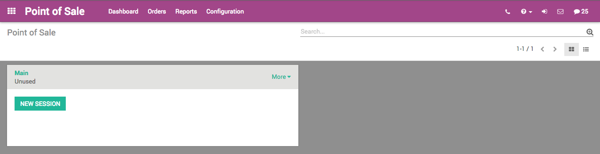
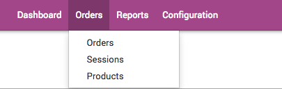
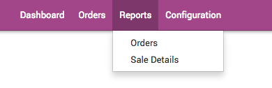
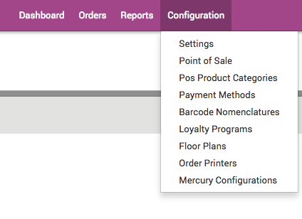
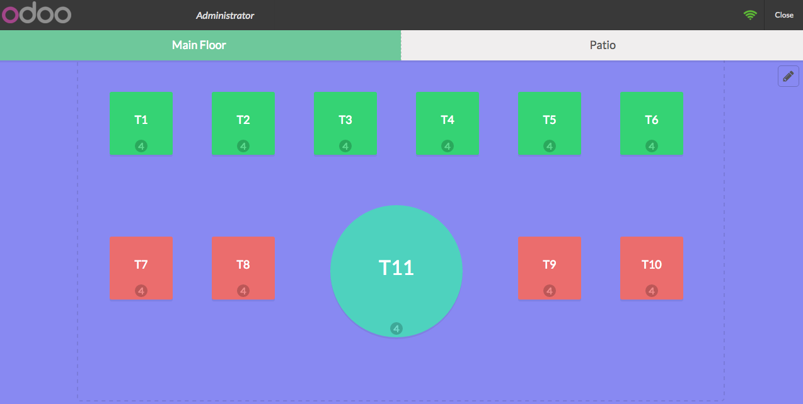

==============
Punto de Venta
==============

Primer vistazo
==============

El módulo de Punto de Venta se puede distinguir gracias a que tiene el icono es 
un maletín. Este es de los más sencillos y complejos a la vez; la forma de uso 
es muy fácil de entender, aparte de que su adaptación a las tabletas hace que 
las ventas se realicen sin ningún problema. Gracias a su nuevo diseño, se puede 
configurar para poder utilizarlo con la vista de “*Restaurante*” la cual ayuda a 
tener un mayor control de los pedidos según las mesas y las diferentes cuentas 
que se vayan a crear. 

En el tablero general se pueden las diferentes sesiones creadas. Estas pueden 
ser por sucursal o por persona, según las especificaciones de cada negocio. 
También se muestran los diferentes menús en la parte superior de la pantalla. 

- Tablero: es la vista principal del módulo, aquí se muestran las sesiones creadas y cuales están abiertas y en uso. 

- Pedidos: en este módulo se pueden ver las órdenes, las sesiones y los productos que tiene registrado el sistema. 

- Informes: esta pestaña muestra las órdenes y los detalles de la venta. 

- Configuración: permite poder hacer ajustes en los términos y en la forma de registrar las ventas. Esto se ajustará según las necesidades de las empresas.

Pestaña Pedidos
===============

En el menú **Pedidos** vienen diferentes opciones, las cuales tienen un propósito específico. 

Pedidos
-------
En esta sección aparecerá una lista de los pedidos realizados, los cuales se podrán 
acomodar según las diferentes opciones que se tienen. Al dar clic en crear aparecerá 
una pantalla con una vista de ficha técnica, la cual se tendrá que llenar con diferentes 
datos para poder dar de alta el pedido. Con el número de referencia, el vendedor de la 
sesión, posición fiscal, la fecha del pedido y la mesa. Cuenta también con diversas 
opciones para completar los datos y poder brindar un mejor servicio como lo son el 
número de invitados en la mesa, los productos, información extra y notas. 

Sesiones
--------
Son las terminales abiertas (tablet, computadoras) se agregan solas. En estas se 
encuentra el responsable, los métodos de pago, muestra su estado, si está abierta 
o cerrada. Se pueden crear las que sean necesarias según las necesidades del negocio. 

Productos
---------
Aquí se podrá tener un control de los productos y las especificaciones de cada uno. 
Es posible modificarlos para poder tener toda la información posible y así poder 
categorizarlos de la mejor manera. 

Reportes
========

El siguiente menú de **Reportes**, brindará números, ganancias, pérdidas, mostrando los 
resultados de manera gráfica o en tablas para poder llevar un mayor control. De igual 
manera en los detalles de la venta se puede especificar la fecha de inicio y termino, 
como otras especificaciones que se quieran tener en cuenta. 

Configuración
=============

En la pestaña de **Configuración**, se pueden hacer ajustes de todo el módulo y de esta 
manera se crea un sistema más personalizado. Estos ajustes son necesarios de realizar 
antes de comenzar a usar el módulo, ya que Las diferentes opciones son las siguientes:

Ajustes
-------
Aquí se puede programar si el punto de venta se usará en una tienda o en un restaurante", así como poder aplicar descuentos, la forma de imprimir las órdenes y los métodos de pago. 

Punto de Venta
--------------
Este mostrará las sesiones y el estado en que se encuentran. Al dar clic en alguna, se desplegará una ventana en la cual es posible modificar todos los permisos y la manera de manejar el módulo desde dicha sesión. En esta sesión vienen los descuentos programables, las áreas de trabajo, categorías, órdenes, impresión de facturas, impresión de órdenes entre otras cosas. 

Categorías de productos
-----------------------
Se encuentran agrupados los productos según las categorías que se hayan creado y a las cuales se les hayan designado. 

Formas de pago
--------------
Se podrán configurar las formas de pago. 

Nomenclaturas de los códigos de barras
--------------------------------------
Aparecerá una nomenclatura base que brinda Odoo, la cual viene descrita con todos los términos que es necesario saber. Usted será capaz de definir los valores que necesita, así podrá tener un mayor control de sus artículos y de sus ventas. 

Programas de fidelización
-------------------------
Esta es el área para definir las reglas de los descuentos, donde se especifican los cambios por categorías de productos. 

Planos de la planta
-------------------
En el caso de la vista de Restaurante, permite configurar las entradas según las diferentes áreas del mismo. 

Impresión de las órdenes
------------------------
En esta sección se puede configurar hacia donde se requiere enviar la orden para que esta se imprima, todo esto en caso de tener diferentes áreas como en un restaurante. 

Configuraciones
---------------
En esta parte, permite la configuración para diferentes pagos con varias tarjetas de crédito previamente establecidas en las formas de pago. Esto también permitirá las transacciones del punto de venta.

Vista Restaurante
=================

En caso de que se establezca el punto de venta en modo de **Restaurante** este permitirá 
tener una vista desde arriba del lugar. De esta manera es posible ajustar las órdenes y 
las ventas por mesa, teniendo un mayor control del mismo, así como administrando los 
lugares disponibles en caso de llegar a tener muchos clientes.

De igual manera, cada mesa tendrá su pedido, así mismo dentro del pedido de la mesa 
es posible abrir diferentes cuentas para poder dividir desde un inicio los pedidos y 
al cerrar la cuenta, sea más sencillo pagar.

Escrito por Alejandra Escandón (Jarsa)